# 1. 开发环境

**<u>*早期开发环境*</u>**

- Vivado + SDK + Petalinux + Vitis HLS

**<u>*新版开发环境*</u>**

- Vivado + Vitis + Petalinux

- Vitis 是指 Vitis Unified IDE，集成了SDK和Vitis HLS的功能
- Vitis Unified IDE 提供了 Vitis classic 以及 Vitis HLS，和传统 GUI 几乎保持一致

- 更多关于Vitis Unified IDE的介绍，参考 [ug1553](https://docs.amd.com/r/en-US/ug1553-vitis-ide/Components-and-System-Projects)

**<u>*个人开发环境*</u>**

- `windows`: vivado +vitis
- `wsl`: petalinux & 交叉编译
- `vmware ubuntu`: write SD card
- wsl中使用make报错（path中包含 `\n`…），解决办法：https://www.zaqlabs.com/linux/separating-wsl-linux-path-and-window-path/

# 2 Petalinux

> 参考文献：ug1144 Petalinux Tools Documentation Reference Guide
>
> Xilinx的User Guide几乎都有版本号，根据自己配置的版本下载对应版本的文档
>
> 本文只记录开发过程中遇到的问题，不提供Demo，直接看ug1144即可

***<u>Introduction</u>***

- Petalinux 是 Xilinx 公司推出的嵌入式Linux开发套件，包括了Linux Kernel，u-boot, device-tree, rootfs等源码、库，以及 Yocto recipes
  - petalinux 底层是 ][Yocto](https://www.cnblogs.com/chegxy/p/14394333.html) 
- Petalinux支持ZynqMP、Zynq7k全可编程SoC，以及MicroBlaze，可与Xilinx硬件设计工具 Vivado协同工作，大大简化了Linux系统的开发工作

***<u>The Petalinux tool contains</u>***

- Yocto Extensible SDK
  - [Yocto VS. petalinux](https://fpga.eetrend.com/content/2020/100049459.html)
- XSCT and tool chains
- Petalinux Command Line Interface tools

***<u>Two ways to build the petalinux images</u>***

- <u>*XSCT Flow*</u>: using the XSCT flow by provding xsa file as input to petalinux-config
- <u>*system-device-tree(SDT)*</u>:  using system-device-tree, you can also build the images without relying on XSCT. The input to petalinux-config is system-device-tree instead of XSA
- *<u>Note</u>*: SDT仅支持Zynq MP and Versal系列的FPGA，不包含Kria，System Controller、Zynq、Microblaze, and EmbeddedPlus等

**<u>*Design Flow Overview*</u>**

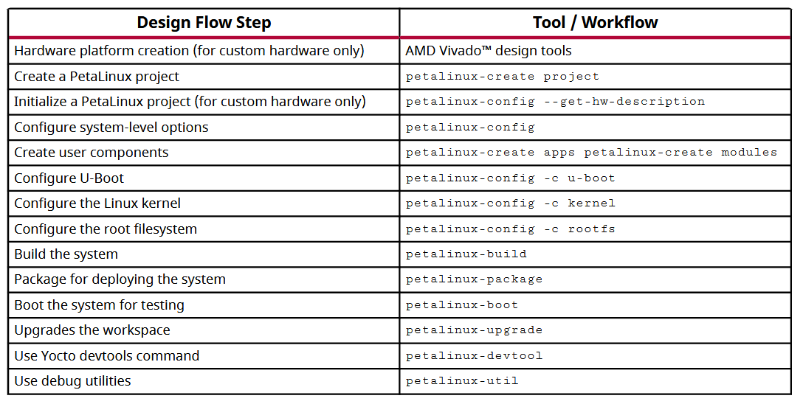

***Petalinux Project Structure***

- A Petalinux project supports development of a single Linux system development at a time

- A built Linux system is composed of the following components

  - Device tree
  - First stage boot loader (optional)
  - U-Boot
  - The root file system is composed of the following components:
    - Prebuilt packages
    - Linux user applications (optional)
    - User modules (optional)

- A petalinux project directory contains：

  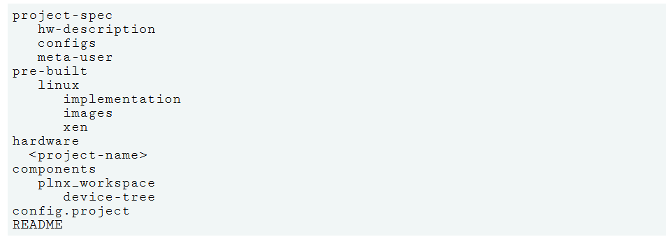

  - Petalinux Project Description：参考ug1144, Table 38

<u>***When the project is built, three directories are auto generated***</u>

- `<plnx-proj-root>/built` for the files generated for build
- `<plnx-proj-root>/images` for the bootable images
- `<plnx-proj-root>/build/tmp` for the files generated by Yocto. This directory is configurable through petalinux-config
- `<plnx-proj-root>/components/yocto` has Yocto eSDK. This file is generated when  execute petalinux-config/petalinux-build.
- When petalinux-package --prebuilt is run, it creates a `pre-built/` directory in  `<PROJECT>/` and copies the build image files from the `<PROJECT>/images/linux`  directory to the `<PROJECT>/pre-built/linux/images/` directory.

**<u>*PetaLinux Menuconfig System（Zynq 7000）*</u>**

- `Ref. ug1144/ch.10/Petalinux Menuconfig System`

**<u>*常用命令*</u>**

```bash
#source settings.sh
#source components/yocto/source/aarch64/environment-setup-aarch64-xilinx-linux
#source components/yocto/source/aarch64/layers/core/oe-init-build-env
#export PATH=/home/work/petalinux/tools/hsm/bin:$PATH
#bitbake fsbl -c cleansstate
#bitbake fsbl
ZYNQMP_CONSOLE=cadence1
$cat QSPI_R5_0.bif
the_ROM_image:
{
    [fsbl_config] r5_single
    [bootloader] R5_FSBL.elf
    [destination_cpu=r5-0] R5_core0_hello_world.elf
}
$ bootgen -r -w –image ./QSPI_R5_0.bif -o Boot.bin
$ cat SD.bif
the_ROM_image:
{
    [fsbl_config] a5x_x64
    [bootloader] ron_a53_fsbl.elf
    [destination_cpu=a5x-0] A53_core0_hello_world.elf
}
$ bootgen -r -w -image SD.bif -o Boot.bin
UltraZed IO Carrier Card
#/etc/init.d/openbsd-inetd restart
petalinux的一些命令：
消除编译时的警告信息：
# petalinux-util --webtalk off
创建新工程：
#petalinux-create --type project --template zynqMP --name <project-path>
bsp创建工程
#petalinux-create -t project -s <path-to-bsp>
配置命令：
#petalinux-config --get-hw-description=design_1_wrapper.xsa 
清理：
#petalinux-build -x distclean
#petalinux-build -x mrproper # 不要轻易执行，会清除缓存，下次build的时候，需要重新下载很多依赖
打包BOOT的命令：
#petalinux-package --force --boot --fsbl zynqmp_fsbl.elf --fpga design_1_wrapper.bit --pmufw pmufw.elf --atf bl31.elf --uboot
#petalinux-package --boot --fpga system.bit --u-boot --kernel
#petalinux-package --boot --fpga system.bit --u-boot
#petalinux-package --boot --fpga system.bit --u-boot --add system.dtb --offset 0x01440000 --kernel --add rootfs.jffs2 --offset 0x02460000  --force
#petalinux-build -s
#petalinux-package --sysroot
petalinux-build -x package  //To regenerate the image.ub, Image and rootfs.cpio.gz
petalinux-build -c device-tree -x mrproper
petalinux-build -c device-tree
petalinux-build -c arm-trusted-firmware
petalinux-build -c bootloader
petalinux-build -c kernel
petalinux-build -c u-boot
petalinux-build -c device-tree -x mrproper
First create the application
$ petalinux-create -t apps -n myapp --enable
petalinux-build -c rootfs
petalinux-create -t apps --template install --name myapp --enable
Rebuild PetaLinux project for the Linux application
You can rebuild the whole project,rootfs or just the application
$ petalinux-build
$ petalinux-build -c rootfs
$ petalinux-build -c rootfs/myapp
To add Linux user libraries to your rootfs.
$ petalinux-create -t libs -n mylib --enable
The above command will create a Linux user library "mylib" in "components/libs/mylib"
$ petalinux-build -c rootfs/mylib
PetaLinux uses library priorities to decide the compilation sequence of the user libraries.
To specify the priority of you library
$ petalinux-create -t libs -n mylib --enable --priority X
X is the priority of your library."1" has the highest priority which will be built first.
Please find the available priorities from with the "--help" of "petalinux-create -t libs".
#zcat rootfs.cpio.gz | cpio -idmv 
#zcat rootfs.cpio.gz | fakeroot cpio -idmv 
#cpio -idmv < rootfs.cpio 
#find ./* | cpio -H newc -o > rootfs.cpio （或者 find ./* | cpio -H tar -o > rootfs.cpio）
#gzip rootfs.cpio
```

**<u>*dnf and rpm*</u>**

- https://retzzz.github.io/980eef66/

**<u>*petalinux version control*</u>**

- `Ref. UG1144 Ch.4-Version Control`

- You can have version control over your PetaLinux project directory `<plnx-proj-root>`, excluding the following:  

  ```
  /.petalinux
  /!.petalinux/metadata
  /build/
  /images/linux
  /pre-built/linux
  /components/plnx-workspace/
  /components/yocto/
  /*/*/config.old
  /*/*/rootfs_config.old
  /*.o
  /*.log
  /*.jou
  ```

# 3. Lab1: Boot from SD

> [Ref. UG1165 Example4: Creating Linux Images](https://docs.amd.com/r/en-US/ug1165-zynq-embedded-design-tutorial/Example-4-Creating-Linux-Images)

**<u>*Input and Output Files*</u>**

- Input files
  - System_wrapper.xsa
  - Petalinux zc702 BSP
- Output files
  - Petalinux boot images(BOOT.BIN and image.ub)

**<u>*Step1: Create a PetaLinux project using the following command*</u>**

```bash
# Using the BSP
petalinux-create -t project -s <path to the xilinx-zc702-v2023.2-final.bsp>
# Using the template for custom boards
petalinux-create -t project --template zynq -n xilinx-zc702-2023.2
```

**<u>*Step2: Reconfigure the project with system_wrapper.xsa:*</u>**

```bash
petalinux-config --get-hw-description=design_1_wrapper.xsa --silentconfig
```

**<u>*Step3: Build the PetaLinux project:*</u>**

```bash
petalinux-build
```

**<u>*Step4: Generate the boot image using the following command*</u>**

```bash
cd images/linux
petalinux-package --boot --fsbl zynq_fsbl.elf --u-boot --force

# 如果有bitstream，则使用如下命令（本实验不涉及PL部分的编程）
petalinux-package --boot --fsbl zynq_fsbl.elf --fpga system.bit --u-boot u-boot.elf --force
```

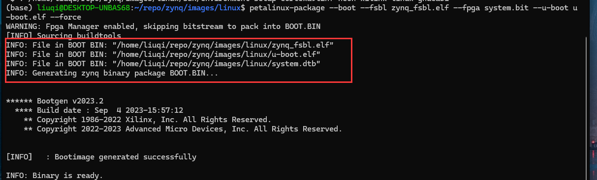

- The `petalinux-package --boot` tool adds `system.dtb` into the `BOOT.BIN` for compatibility with a separate uImage, dtb and rootfs, instead of the FIT format for `image.ub`. The added `system.dtb` partition is not used during boot if `image.ub` is used. For details, refer to the code in `boot.scr`.

**<u>*Step5: Generate the sysroot required for generating a linux application using the following command:*</u>**

```bash
petalinux-build --sdk
petalinux-package --sysroot
```

**<u>*Step6: Boot on Physical Zynq7035*</u>**

- Step 6.1: copy the <u>Boot.bin, image.ub, and boot.src</u> files to the SD card

- Step 6.2: set up the board

- Step 6.3: change the boot mode to SD boot

- Step 6.4: connect the serial communication utility with the baud rate set to 115200

- Step 6.5: Power on the target board

- Step 6.6: The Linux login prompt will appear. 

  - Use user name `petalinux` and create a new password and login
  - Use `sudo -i` to assign privileges

- 运行结果(此时还是`tmpfs,`没有挂载存储设备，无法进行持久化存储

  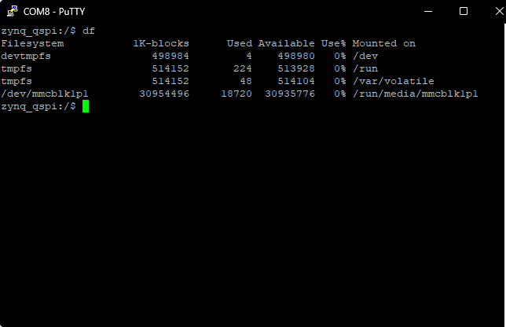

**<u>*Step7 将SD卡作为文件根文件系统*</u>**

- Ref. UG1144/chapter7/Configuring SD Card ext File System Boot

- 这里需要将SD卡分成两个区，分别是BOOT区和ROOT区

- BOOT Partition需要是FAT32格式，存储：BOOT.BIN、boot.scr、image.ub

- ROOT Paritition需要是EXT4格式：将rootfs.tar.gz的文件解压到这个分区

- 注意点1：有些开发板可能有好几个SD（emmc也绑定在SD引脚上），需要在petalinux中配置primary SD和rootfs的格式：

  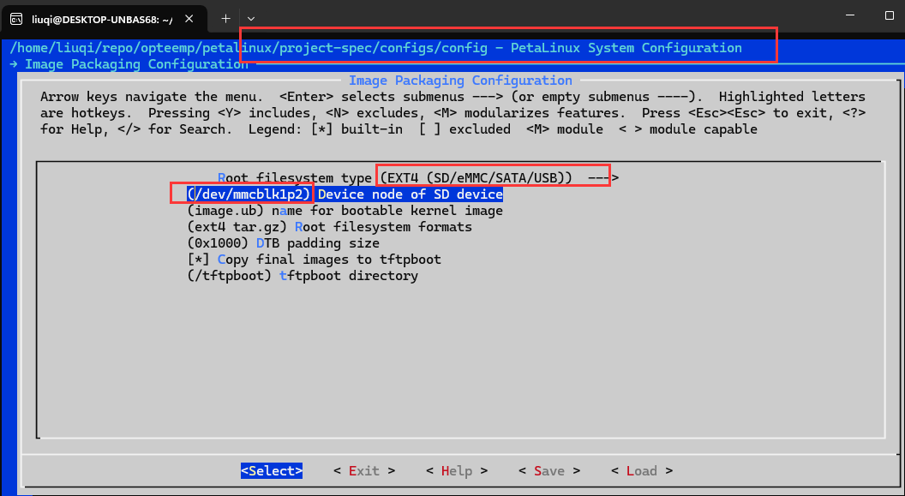

- 注意点2：需要在设备树中关闭SD卡的写保护，如下所示（节点不一定是 `&sdhci1`，具体需要看Vivado中如何绑定SD引脚的）：

  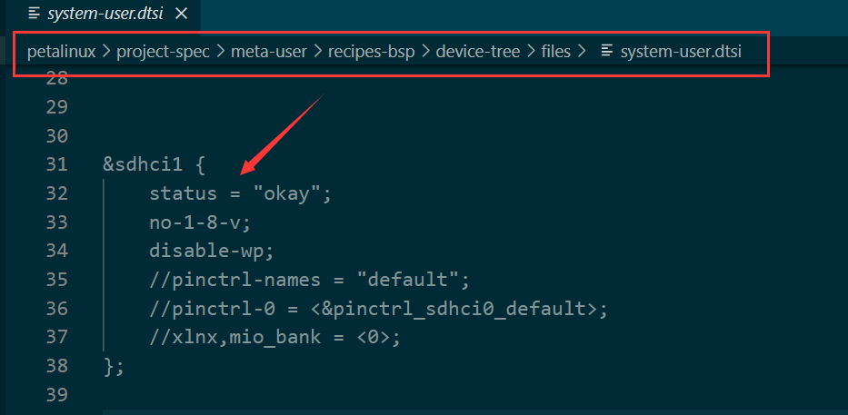

***<u>Step8 检查Network是否能够工作</u>***

- 如果是校园网，ping自己主机即可。如果想要ping外网，需要先登录校园网（北邮是这样）
- 北邮校园网命令行登录：`curl 'http://10.3.8.211/login' --data 'user=学号&pass=密码' `

**<u>*Step9 搭建NFS文件挂载*</u>**

- 在主机上搭建NFS Server

  ```bash
  sudo apt-get install nfs-kernel-server
  sudo gedit /etc/exports
  # 在尾部添加/home/xxx/xxx *(rw,sync,no_root_squash,no_subtree_check) ,配置  /xxx/xxx 目录为 NFS 的一个工作目录。
  sudo /etc/init.d/rpcbind restart
  sudo /etc/init.d/nfs-kernel-server restart
  ```

- 在Zynq Linux上挂载目录

  ```bash
  sudo mount -t nfs 10.112.110.55:/home/liuqi/NFSDIR ./nfsdir
  ```

**<u>*Step10 刚搭建的linux还缺少很多库，例如apt-get、vim等，可以自行探索安装*</u>**

- `Ref. ug1393/Ch.61/Software Management in Petalinux rootfs`

# 4. Lab2: Boot from QSPI Flash

> 从QSPI加载Linux kernel，在eMMC中存储linux kernel image以及root filesystem

**<u>*Motivation*</u>**: 

- SD卡容易脱落，但是QSPI是焊在开发板上的，因此如果能够从QSPI启动Linux，更加稳定。

**<u>*Boot flow*</u>**

- Step1: BootROM loads FSBL
- Step2: FSBL load bitstream and U-Boot, and give control to U-Boot
- Step3: U-Boot reads boot.src from Flash offset 0x00FC0000 by default
- Step4: U-Boot reads the image.ub and launch linux kernel

**<u>*Flash partition table*</u>**

| Partition | Flash Offset Address                         | Size       | DDR Loading Address           |
| --------- | -------------------------------------------- | ---------- | ----------------------------- |
| FSBL      | 0x0                                          | Very Small | Address info embedded in ELF  |
| Bitstream | Continuous with previous                     | 3.9 MB     | FSBL loads it as data         |
| u-boot    | Continuous with previous partition           | Very Small | Address info embedded in ELF  |
| image.ub  | U-Boot loads it from 0x01000000              | 11 MB      | U-Boot loads it to 0x10000000 |
| boot.scr  | U-Boot reads it from Flash offset 0x00FC0000 | 2 KB       | U-Boot loads it to 0x03000000 |

**<u>*Input and Output Files*</u>**

- Input files

  - `zynq_fsbl.elf`: 

  - `u-boot.elf`

  - `system.dtb`

  - `FPGA bit file`

  - `image.ub`

  - `boot.src`

- Output files
  - `BOOT.BIN`

**<u>*Step1: Changing boot.src for image.ub Offset Address and Sie*</u>**

- u-boot默认从`0x01000000`地址读取image.ub
- `0x01000000`地址要求Flash至少有16MB的容量，不够的话需要修改image.ub存储地址
- Zynq 7035的QSPI Flash为256MB，这一步可以直接跳过
- 如果QSPI Flash容量小于等于16MB，可以按照ug1165的example 10的教程进行修改

**<u>*Step2: Building the petalinux project*</u>**

- 执行`petalinux-build`，Lab1如果顺利完成，这一步可以跳过

**<u>*Step3: Making a Linux Bootable Image for QSPI Flash with Petalinux*</u>**

```bash
cd ./images/linuxboot
petalinux-package --boot --u-boot --add boot.scr --offset 0xfc0000 --kernel --force
```

- `--fpga` option assigns the optional FPGA bit file（这里没有涉及PL，所以不加该参数）

- `--u-boot` packages u-boot.elf into BOOT.BIN

- `--add --offset` will add a data file to a specific flash offset

- `--kernel` adds image.ub to Flash offset `0x01000000` by default

- `--force` forces an overwrite if BOOT.BIN already exists

- FSBL is added by default. You don't need to add an option to assign it

- 遇到报错：

  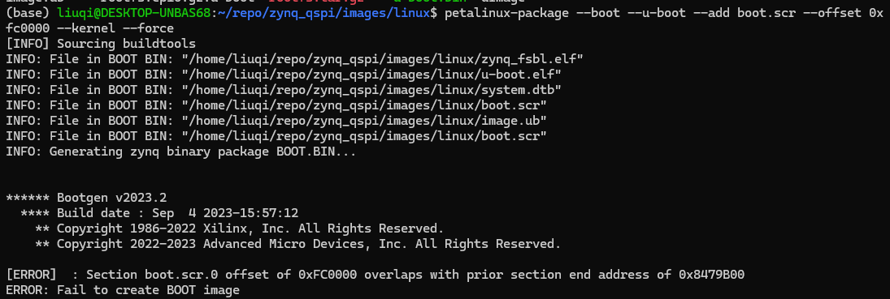

**<u>*Step3.1 解决BUG*</u>**

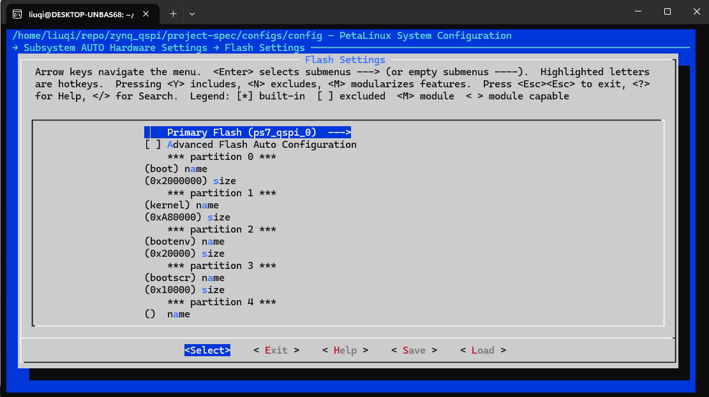

- 空间分配策略

  - boot 32MB，存放BOOT.BIN

  - kernel 10MB，存放image.ub
  - bootenv 128KB
  - boorscr 64KB

- Flash Partiton Table from ug1144 p128

  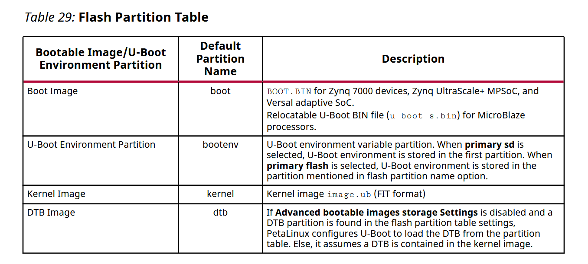

- 修改package命令

  ```bash
  petalinux-package --boot --u-boot --add boot.scr --offset 0x2AA0000 --kernel --force
  
  # bootscr offset = boot size + kernel size clear+ bootenv size = 0x2AA0000
  ```

- package成功

**<u>Step4: Making a Linux Bootable Image for QSPI Flash with Vitis IDE</u>**

- 拷贝如下四个文件到Vitis Unified IDE所在的主机上

  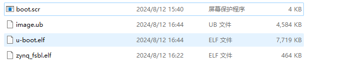

- 打开Vitis Unified IDE,  go to Vitis $\rightarrow$ Create Boot Image $\rightarrow$ Zynq

- 选择 creating a new BIT file，进行如下配置

  | File Path  | Partition Type | Load      |
  | ---------- | -------------- | --------- |
  | fsbl.elf   | bootloader     |           |
  | u-boot.elf | datafile       |           |
  | image.ub   | datafile       | 0x2000000 |
  | boot.scr   | datafile       | 0x2AA0000 |

- 配置完成后，检查生成的eif文件，如下所示

  

**<u>*Step5 Program QSPI Flash*</u>**

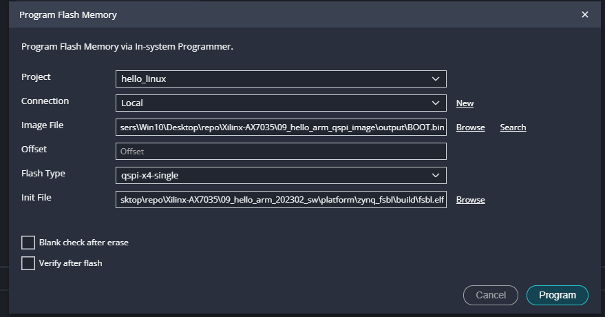

**<u>*很遗憾，启动失败！！因为eMMC里面没有文件系统*</u>**

- 在这之间，我将rootfs的类型设置成了【SD/eMMC...】，petalinux会生成一个压缩包，包含根文件系统。需要将这个压缩包解压到eMMC或者SD卡，然而上述过程中，没有将rootfs写入到eMMC中，所以FPGA通电后没反应
- 如果想要跑通上述流程的话，理论上在petalinux中配置 Root filesystem type 为 Initramfs 即可
- 无法将BOOT.BIN文件放到eMMC中，因为Zynq的Boot MODE不包含从eMMC启动。所以只能先从QSPI启动，将BOOT.BIN和Kernel镜像放到QSPI Flash中，根文件系统放到eMMC中。eMMC不支持Vivado或者Vitis读写数据，下面提供两种可行方法，用于将根文件系统写入到eMMC中
  - 方法1：先通过SD卡启动Linux系统，然后挂载eMMC，向eMMC中写入文件系统
  - 方法2：搭建NFS文件系统，启动linux，然后对eMMC进行分区挂载


# 5. Sidenotes

**<u>*SDK Generator*</u>**

- 参考 ug1144/ch.11/SDK Generator (target sysroot generation)

- The OpenEmbedded build system uses `BitBake` to generate the Software Development Kit(SDK)  installer script based standard SDKs

- Petalinux builds and installs SDK

- The installed SDK can be used as sysroot for the application development

- Building SDK & Installing SDK

  ```bash
  petalinux-build --sdk
  petalinux-package --sysroot
  ```

**<u>*tmpfs*</u>**

- tmpfs是许多类Unix操作系统中实现的临时文件存储范例
- 旨在显示为已安装的文件系统，但数据存储在易失性内存中，而不是持久存储设备中
- 类似的结构是RAM磁盘，显示为虚拟磁盘驱动器并托管磁盘文件系统
- 优点
  - RAM的速度比磁盘更快，tmpfs允许存储在RAM中，实现更加高效的文件系统
  - RAM在重新启动的时候会被清除，因此tmpfs可以防止系统变得过于混乱，而无需用户手动删除临时文件
  - 将临时文件存储在RAM中，可以防止磁盘过快填满，并通过减少写入次数来延长磁盘的使用寿命
- 缺点
  - 文件存储在RAM中，系统重新启动会导致文件丢失
  - 会占用大量的内存
- 使用场景
  - temps适合存储socket、session等，对于高IO的临时数据也可以选择进行存储
  - 如果需要持久化，还需要通过其他手段实现

**<u>*如何将rootfs从WSL顺利解压到SD卡*</u>**

- 不推荐将SD卡挂载到WSL，据说需要编译WSL内核，没尝试
- 直接用VMware安装Linux虚拟机，将SD卡挂载到虚拟机，然后将rootfs解压到SD卡的ROOT分区

**<u>*Fetch Error 解决办法*</u>**

1. 以 zynq 7035，petalinux2023.2 为例

2. Download and untar the PetaLinux release sstate-cache files from [download-link](https://www.xilinx.com/support/download/index.html/content/xilinx/en/downloadNav/embedded-design-tools.html). Here we are taking 2023.2 as an example.

   - zynq 7000 下载arm类型的sstate cache，要和petalinux的版本号对应

3. Go to your 2023.2 PetaLinux project and set the following options using petalinux-config

   ```bash
   SSTATE Template: 
   $ petalinux-config --> Yocto Settings --> Add pre-mirror url --> file://<path-to-downloads>
   $ petalinux-config --> Yocto Settings ---> Local sstate feeds settings --> local state feeds url --> <path-to-downloads>
   
   SSTATE Example Usage: 
   $ petalinux-config --> Yocto Settings --> Add pre-mirror url --> file:///home/liuqi/download/arm
   $ petalinux-config --> Yocto Settings --> Local sstate feeds settings --> local sstate feeds url --> /home/liuqi/download/arm
   ```

   Note: For PREMIRRORS usage you need to add the *file, git, http or https* protocol followed by the path, but this is not true for SSTATE feeds.

4. For setting up the download and shared state directories add the following variables in the `<plnx-proj-root>/project-spec/meta-user/conf/petalinuxbsp.conf` file.

   ```
   # DL_DIR and SSTATE_DIR Template: 
   DL_DIR = "<PATH-TO-DOWNLOADS-DIRECTORY>/<PetaLinux-Version>/downloads"
   SSTATE_DIR = "<path-to-downloads>"
   
   # DL_DIR and SSTATE_DIR example usage:
   SSTATE_DIR = "/home/liuqi/download/arm"
   ```

   Note: DL_DIR and SSTATE_DIR directories should have read and write permission.（实测，不配置DL_DIR也可以，用默认的）

5. Now you need to start the build and if you are building the SDK (*petalinux --sdk*) then enabling the network is mandatory for a fresh build.

   ```bash
   # Build Commands: 
   petalinux-build --sdk
   ```

6. sstate cache并不是把所有需要的包都缓存了，这个时候还是需要联网的。先联网build一遍，把需要的包的下载下来

   ```
   # 如果执行了Step5，这一步可以跳过 （petalinux-build --sdk）
   petalinux-build -x mrproper
   petalinux-build
   ```

7. 下载完成之后就可以设置BB了（offline build）

   ```bash
   # Set BB_NO_NETWORK: 
   petalinux-config --> Yocto Settings --> [*] Enable BB NO NETWORK`
   ```

8. clean workspace and rebuild（test if everything is ok）

   ```bash
   petalinux-build -x mrproper
   petalinux-build
   ```

***<u>BUG记录</u>***

- 将镜像和文件系统都加载到SD卡之后，启动FPGA开发板，串口无输出

- 使用qemu进行模拟

  ```bash
  # 生成prebuilt文件夹
  petalinux-package --prebuilt --fpga
  # 生成wic文件
  petalinux-package --wic
  # 仿真选项
  petalinux-package --prebuilt --fpga
  petalinux-boot --qemu --u-boot 
  petalinux-boot --qemu --kernel
  ```

- 仿真没问题，能够正常启动

- 但是串口还是没输出，于是乎重启了FPGA开发板，主机，WSL。再尝试的时候恢复了正常.......

**<u>*BUG记录，SD卡没有写权限*</u>**

- Ref1: https://support.xilinx.com/s/question/0D54U00006yYhXiSAK/manipulating-device-tree?language=en_US

- Ref2: `ug1144/Ch.10/Configuring Project Components/Device Tree Configuration`

  ```
  /include/ "system-conf.dtsi"
  / {
  };
  &sdhci1 {
          status = "okay";
          no-1-8-v;
          disable-wp;
  };
  ```

**<u>*BUG记录，uboot无法启动kernel*</u>**

- 也许是因为uboot没有找到设备树。通常设备树(e.g. system.dtb)会打包进BOOT.BIN文件或`image.ub`文件中。不过有时候uboot没法在这两个地方找到设备树，可能是设备树的offset没有设置对。最好的办法就是，使用petalinux生成的uboot-dtb.elf文件，将设备树写进了uboot-dtb.elf文件内部

***<u>Summary</u>***

- 采用SD卡的形式更加灵活，可以拷贝整个SD卡的内容到另一张SD卡，实现整个系统的备份

- SD卡分为`BOOT`和`ROOT`两个分区

- ROOT分区

  - Petalinux配置

    Step1: `cd <petalinux-proj-root>`

    Step2: `petalinux-config`

    Step3: `Select Image Packaging Configuration` $\rightarrow$ Root file system

  - ext4 文件格式，将petalinux工具生成的rootfs.tar.gz文件解压到该分区根目录即可

- BOOT分区，包含 BOOT.BIN、image.ub, boot.scr

  - BOOT.BIN包含 FSBL、U-BOOT、Bitstream


