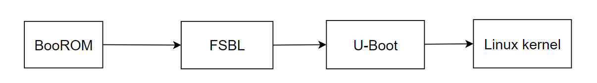
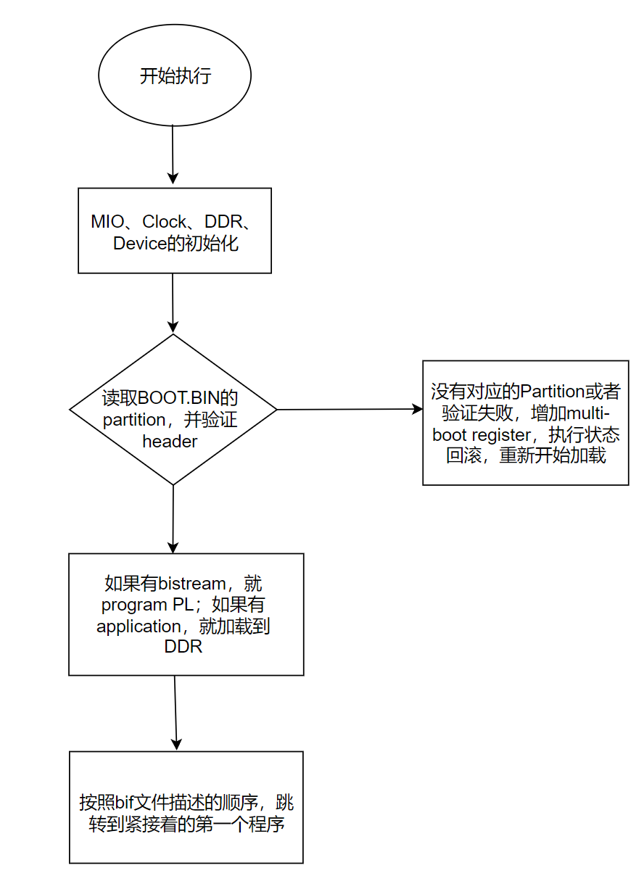
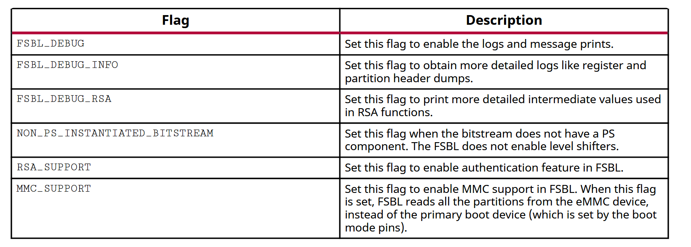
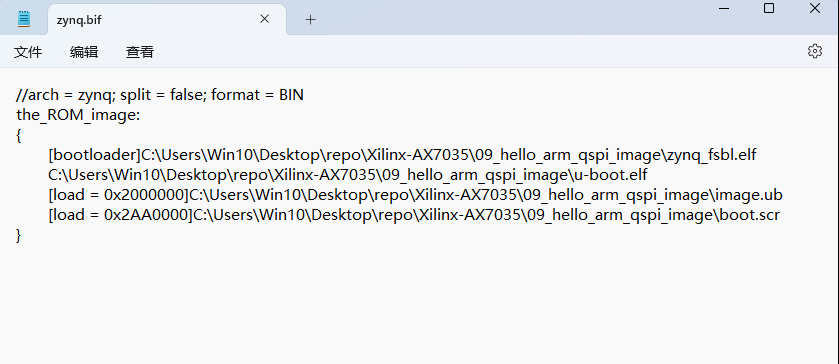
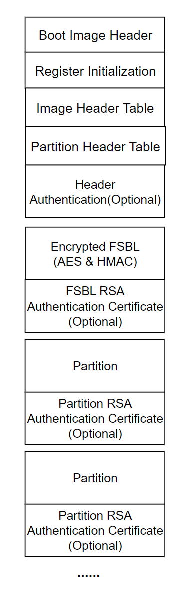
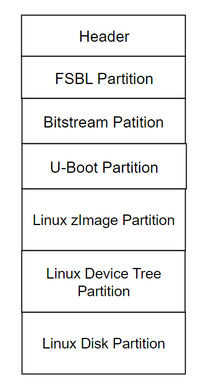
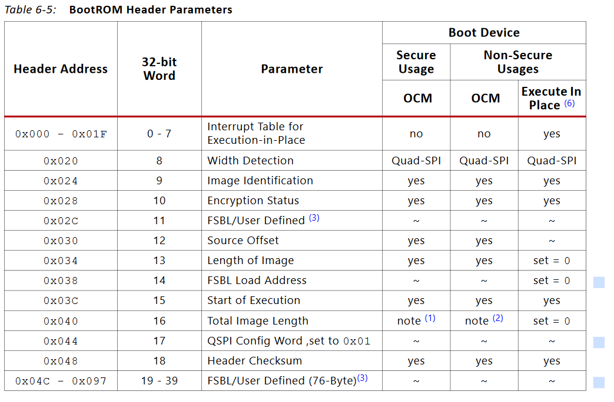
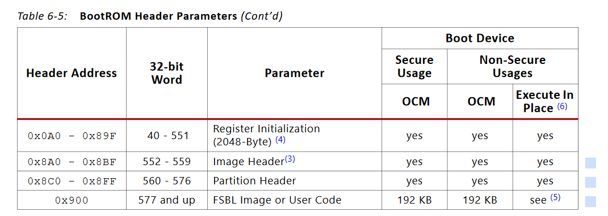
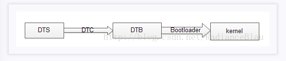

# 1. Brief Description

 
  

BootROM是FPAG通电后执行的第一段代码（execute in on-chip ROM），配置ARM核和必要的外设(e.g. SD)，会根据`Boot Mode`从相应存储设备的`BOOT.BIN`文件中读取FSBL（first stage boot loader），并加载到OCM（on-chip memory）中，存储设备通常为SD卡、NAND、QSPI Flash等。加载完成后，BootROM启动FSBL，FSBL负责后续启动流程。

FSBL负责两件事，第一件事是加载`bitstream`并部署到PL上；第二件事依据开发模式不同而不同，如果是裸机开发，第二件事就是加载并执行裸机程序，如果是嵌入式Linux开发，则第二件事是加载并执行u-boot。bitstream 和 [裸机程序/u-boot] 都打包存储到BOOT.BIN文件中。FSBL代码开源，用户可以下载源代码并根据需求进行修改。

如果是裸机开发，此时已经完成了整个平台的启动。如果是嵌入式Linux开发，还剩最后一步，即u-boot加载并启动linux kernel。

FPGA开发板支持如下三种`Boot Modes`

- PS Master Non-secure BOOT
- PS Master Secure BOOT
- JTAG / PJTAG Boot

本文记录从零开始在Zynq 7000开发板上搭建linux系统，并且不涉及PL端，并且不涉及User Code（如果有的话，User Code由BootROM加载并执行）

# 2. BootROM

BootROM 是一段被固化在Zynq芯片内部的程序，所谓固化就是存储在片内ROM中，不可更改。片内ROM通常是Nor Flash，特点是片内执行(XIP)，不需要将BootROM的代码拷贝到OCM当中。双核A9设备中，BootROM在CPU 0上执行，CPU 1 执行 wait -for-event (WFE) instruction。FPGA启动分为两种模式: POR and non_POR

- POR (`power-on-reset`): 会重置整个设备，不保留任何之前的状态
- non-POR：部分寄存器的值被保留下来（主要是Security相关的寄存器）

Main tasks of BootROM：

- 执行必要的初始化，例如ARM core、SD卡等外设
- 从启动设备中加载FSBL或User Code到OCM中，然后执行FSBL或者User Code
- 如果是non-secure模式下，FSBL和User Code也可以在ROM内执行

以SD卡启动为例，要求SD卡启动为标准的SD/SDHC设备，BootROM能够解析fat32或者fat16文件系统。SD卡启动时，BootROM执行流程如下：

- Step1：初始化MIO引脚，主要是引脚对应寄存器的配置
- Step2：初始化SD卡外设，驱动SD卡
- Step3：对SD卡进行读写测试
- Step4：从SD卡中读取BOOT.BIN文件按，并对BOOT.BIN文件进行解析
  - BOOT.BIN头部信息包含fsbl加载地址、大小以及fsbl在BOOT.BIN文件中的位置的偏移量
- Step5：从BOOT.BIN文件中，将fsbl代码拷贝到OCM中，并且跳转到fsbl代码的运行地址，运行fsbl

QSPI启动和SD卡启动几乎相同，区别在于QSPI Flash不支持文件系统，那么如何从QSPI中找到我们需要的BOOT.BIN文件？（参考UG585/ch.6.3.10）

**<u>*Secure Boot and Non-secure Boot*</u>**

# 3. FSBL

> FSBL main 函数（SDK中的FSBL Application FSBL Template）

**<u>*Main Task of FSBL*</u>**

- 进一步初始化PS硬件
- 如果BOOT.BIN文件中包含Bitstream的话，将Bitstream加载到PL上
- 加载SSBL(u-boot) 或者 裸机程序到DDR memory中
- Handoff to FSBL or bare-metal application

**<u>*FSBL Flow Chart*</u>**

  

- 上图中展示了一个最简易的 workflow，在 secure mode 模式下，FSBL 的 workflow 将会更加复杂
- 关于Multi-Boot，FSBL回滚(fallback)：除了FSBL加载的第一个Bootable Image（记作 image 1），在启动设备中还存储着一个已知没有问题，能够正确启动的 Bootable Image（记作 image 2）。当 image1 加载失败的时候，会执行状态回滚，搜索并加载 image2。在secure boot和non-secure boot模式下，multi-boot机制略有区别，参考 `UG821 FSBL Fallback Feature`

**<u>*Code Analysis*</u>**：FSBL projecy from Vitis Demo

1. 调用 `ps7_init() `对 PCW 进行初始化
   - PCW initialization for MIO, PLL, CLK and DDR
   - 在Vivado软件中可以通过图形化的方式对ZYNQ PS端外设进行相关配置，这些配置信息会写入到hdf文件，SDK（or petalinux）会对hdf文件进行解析并生成对应的寄存器配置表，然后FSBL工程中会通过ps7_init函数将寄存器配置表写入到对应的寄存器中，完成对MIO/PLL/CLK/DDR等外设的硬件配置
2. 刷DCache缓存，禁用DCache缓存
   - `Xil-DCacheFlush` & `Xil-DCacheDisable`
3. 注册异常处理函数
   - `RegisterHandlers()`
4. DDR读写测试
   - `DDRInitCheck()`
5. PCAP的初始化
   - `InitPcap()`
6. 读取BOOT_MODE寄存器
   - 记录了Zynq的启动方式（QSPI、SD、NAND、Nor、JTAG）
   - 通过MIO3、MIO4、MIO5这三个引脚配置Zynq启动方式
   - Zynq 通电时，会将这三个引脚的状态保存在 BOOT_MODE 寄存器中
7. 根据BOOT_MODE寄存器的值，确定Zynq当前的启动方式
   - 每一种启动方式都有不同的处理方式
   - `MoveImage`函数指针指向`Flash`设备的读写函数实体
8. 加载启动镜像 
   - 调用 `LoadBootImage` 函数: `HandoffAddress  = LoadBootImage()`
   - FSBL的主要工作是启动U-Boot，也要将Bitstream加载到PL上
   - FSBL将U-Boot加载到DRAM之后，跳转到HandoffAddress，开始执行U-Boot

**<u>*FSBL Compilcation Flags*</u>**

  

**<u>*FSBL Hooks*</u>**

- FSBL hooks provide an easy way to plug-in used defined functions, (for example, initializing PL IPs after loading a bitstream). The FSBL hook functions are located in the fsbl_hook.c file.
- The fsbl_hook.c file contains the following functions:
  - `FsblHookBeforeBitstreamDload:` This function is called before the PL bitstream  download. Any customized code. You can add customized code before the bitstream download in this function.
  - `FsblHookAfterBitstreamDload:` This function is called before the handoff to the  application. You can add any customized operations you want to perform before handoff to the application to this function.
  - `FsblHookBeforeHandoff:` This function is the hook to call before the FSBL does a handoff  to the application. You can add customized code to be executed before the handoff to this routine.
  - `FsblHookFallback:` This function is called when the FSBL does a Fallback. You can add  customized code, either to print a message, log an error, or do any other intended operation, when Fallback occurs.

# 4. U-Boot

U-Boot本质上是一段裸机程序。FPGA开发板在静态的情况下，镜像文件一般存储在SD卡或者QSPI外设中，U-Boot会将内核镜像文件拷贝到DDR内存中，并跳转到内核镜像的入口地址。结合U-Boot的功能，不难猜测，U-Boot至少包含SD卡、QSPI等外设的驱动程序用于内核镜像数据读取，以及DDR驱动，用于写内存。除此之外，U-Boot还包含文件系统、网络协议等。

U-Boot支持多种操作系统，例如linux、android、windows等，并支持多种硬件平台，例如Intel, ARM, MIPS等。

U-Boot源码仓库为 [**Uboot源码**](https://github.com/u-boot/u-boot)。SoC厂商（e.g. Xilinx, Intel）会根据U-Boot源码，针对自家硬件平台进行定制，例如[**xilinx u-boot**](https://github.com/Xilinx/u-boot-xlnx)。最后开发板厂商（e.g. diglent）又会在SoC厂商提供的u-boot源码基础上，进行进一步的定制，例如**[u-boot-Digilent-Dev](https://github.com/Digilent/u-boot-Digilent-Dev)**。

# 5. BOOT.BIN

> 参考：ug585 chapter 6.3.2; ug585中，叫BootROM header

**<u>*BOOT.BIN Generation Rules*</u>**

- BOOT.BIN文件由Bootgen工具生成，该工具的配置文件为 bif (Boot Image Format) 文件

  

- BOOT.BIN文件被分为一个一个的partition，每个partition包含一段需要加载的程序。Secure Boot模式下，BOOT.BIN文件格式如下：

  

- BOOT.BIN Demo如下：

  

- FSBL ELF必须在BOOT.BIN的第一部分，紧接着是Bitstream和application
- FSBL完成初始化和加载工作后，会按照bif文件描述的顺序，将执行权交给紧接着的第一个程序

**<u>*BOOT.BIN Header*</u>**

  

  

- 通过BOOT.BIN header如何找到FSBL
  - 0x30地址记录了fsbl代码在BOOT.BIN文件中的位置偏移量
  - 0x34记录了fsbl代码的长度
  - 0x38记录了fsbl代码在SRAM中的加载地址
- 通过BOO.BIN header如何找到U-Boot和bitstream

# 6. Boot Mode

- 两种启动模式

  - Master Mode Boot：Flash Devices (SD, QSPI, NAND.....)
  - Slave Mode Boot：JTAG 

- Boot Mode Pin Settings （ug585 chapter 6.2.5）

  

- 并不是所有的开发板都支持这些启动模式，根据开发板硬件配置的不同而不同，只要支持某一种启动方式，pin setting 和上图必须吻合

# 7. Linux

**[Device Tree](https://e-mailky.github.io/2019-01-14-dts-1#dts%E7%9A%84%E5%8A%A0%E8%BD%BD%E8%BF%87%E7%A8%8B)**

- DTS: device tree source

- DTC: device tree compiler

- DTB: device tree blob

  

- DTSI: 一个SoC可能对应多个machine，`xxx.dtsi`文件描述了SoC公用的部分，machine对应的`xxx.dts`文件include整个`xxx.dtsi`文件即可

# 8. References

[1] [ug585-Zynq-7000-TRM - Ch.6](ug585-Zynq-7000-TRM.pdf) 

[2] [参考视频](https://www.bilibili.com/video/BV1VX4y1572B/?spm_id_from=333.337.search-card.all.click&vd_source=9b511b52d056fb21c406621247aed854)
