# 1. Brief Description

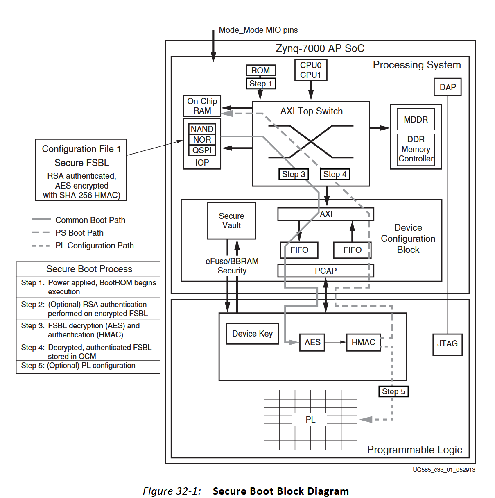

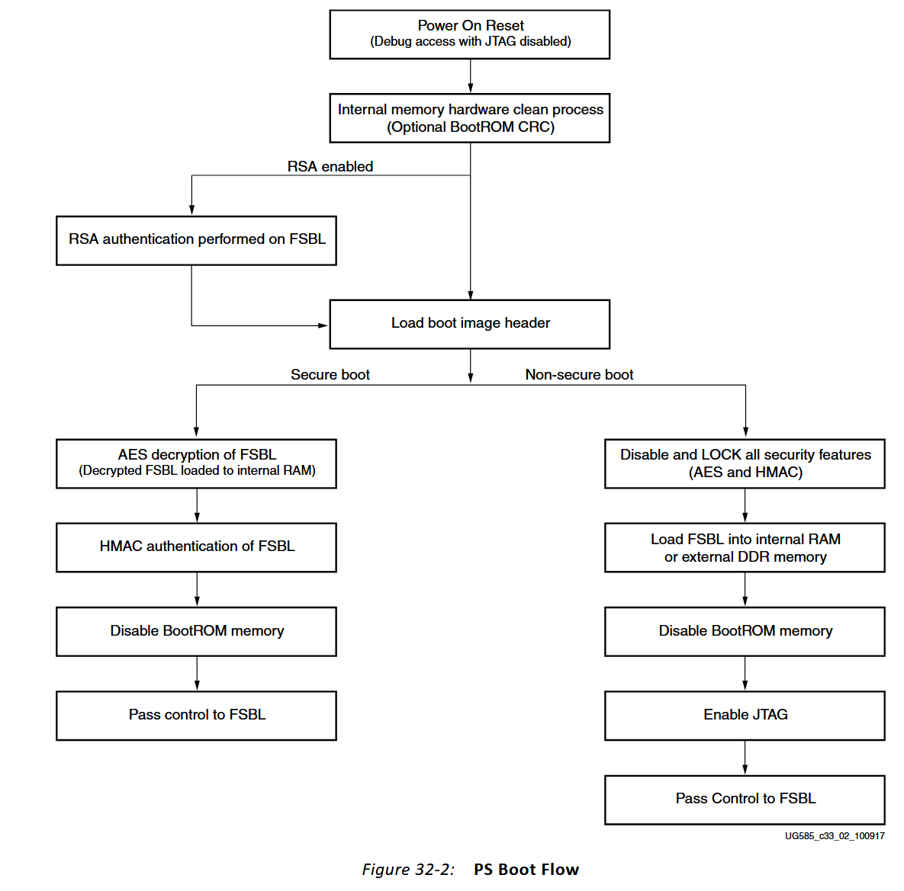

本文基于Zynq7000系列开发板，以及配套user guide文档（2023.2版本）。

当FPGA通电后，BootROM开始执行，在加载FSBL之前，可以对ROM执行CRC校验，校验成功后再开始加载FSBL。关于为何要进行ROM CRC校验，[**这里**](http://www.romdetectives.com/Wiki/index.php?title=CRC)给出了很好的解释，如下：

- This is useful because ROM files are often corrupted, incorrectly dumped, or purposely modified making it difficult to know if a ROM is genuine. By performing a CRC on a ROM, and comparing the result to a known good CRC, you will know instantly if your ROM has been altered or is an original.

当然，针对ROM的CRC校验是可选的，CRC校验大约会带来25ms的启动延迟。当CRC校验通过或者不需要进行CRC校验时，BootROM开始加载FSBL。

BootROM 在读取 BootROM header (i.e. the header of BOOT.BIN) 之前，会检查 RSA Authentication 是否开启，若开启，则用 public RSA key 对 FSBL 进行 authenticate。上图并不明确，对FSBL进行authenticate时，需将FSBL从BOOT.BIN中读出，那么需先读取Boot image header，但上图是在authenticate之后读取 Boot image header。

Authenticate完成后，开启FSBL的加载执行。从流程图可知，两种模式的核心区别如下：

- FSBL：安全启动需要解密，而非安全启动不需要（不需要就会将HMAC和AES给禁用掉）
- JTAG：安全启动没有开启JTAG，非安全启动开启了JTAG
- Load FSBL：安全启动只能将FSBL加载到OCM，而非安全启动可以加载到OCM或者External DDR Memory。根本原因在于安全启动需要对FSBL执行HMAC校验？（待验证）

由于AES和HMAC模块都在PL上，BootROM会将encrypted FSBL通过PCAP传给PL上的AES和HMAC进行解密，解密后的FSBL同样通过PCAP传回PS，BootROM将解密的FSBL加载到OCM并开始执行。如果Boot image中包含bitstream，同样是需要加密的，由AES和HMAN模块进行解密。

说明：FPGA启动分为Master Boot和Slave Boot，secure boot模式仅支持Master Boot。Secure Boot也仅支持NOR、NAND、SDIO，or QSPI Flash，任何其他的启动设备都是不支持的

**<u>*Zynq7000 AP SoC secure boot features:*</u>**

- Advanced Encryption Standard
  - AES-CBC with 256-bit key (FIPS197)
  - Encryption key stored on-chip in either eFuse or Battery-backed RAM (BBRAM)
- Keyed-hashed message authentication code (HMAC, FIPS198-1)
  - SHA-256 authentication engine (FIPS180-4)
- RSA public key authentication (FIPS186-3)
  - 2048-bit public key

# 2. Function Description

## *2.1 RSA Authentication Performed on FSBL*

<u>*Steps*</u>

- Step1：验证PPK。计算 PPK 的 SHA256 signature，和 eFuse 中的 hash 值进行比较。比较通过，则验证成功；否则验证失败，触发 fallback

- Step2：验证SPK。SPK使用PPK对应的私钥做签名，用PPK进行验证即可

- Step3：验证FSBL。FSBL使用SPK对应的私钥做签名，用SPK进行验证即可

- Step4：任何一个验证环节失败，会触发fallback，寻找新的FSBL执行，没有找到设备会进入 secure lockdown 状态。只有NAND、NOR或者QSPI才支持multi-boot，即boot image中支持多个FSBL存在，SD卡不支持multi-boot。应该和SD卡上的Fat32文件系统有关

<u>*RSA signature algorithm*</u>

- Step1：对原始消息做摘要得到M
- Step2：签名者使用私钥d计算签名 $ C = M^d\ mod\ n$
- Step3：验签者使用签名者的公钥进行验证：$M = C^e \ mod \ n$
- Step4：比较两个M的值是否相同，相同则验证通过

## *2.2 Secure FSBL Decryption*

<u>*Steps*</u>

- Step1：BootROM waits until the PL is powered up

- Step2：BootROM begins to load the encrypted FSBL into the AES engine via the PCAP

- Step3：AES/HMAC engines decrypt FSBL

- Step4：The PL sends the decrypted FSBL back to the PS via the PCAP

- Step5：The decrypted image is then loaded into the OCM

The BootROM also monitors the HMAC authentication status of the FSBL and if an authentication error occurs, the BootROM puts the PS into a secure lockdown state.

Xilinx只提供FSBL的Authentication，若其他PS images或PL bistreams需要authentication，RSA的算法必须以软件形式提供。

Xilinx 在 BootROM 里面只实现 FSBL 的 RSA authentication，针对其他 PS Image or bitstream，想要进行 RSA authentication，用户必须在FSBL或者u-boot等software中实现 rsa authentication逻辑。（RSA authentication 和 AES/HMAC 不同。在SecureBoot模式下，AES/HMAC一直开启，FSBL or user code 可以使用）

## *2.3 Secure Boot Image*

<u>*Boot Image Header*</u>的0x28地址，标识了Boot Image是否加密（boot image header 不能加密 ,Boot Image Header中指明AES key在BBRAM还是eFUSE中），以及key source，如下表所示：

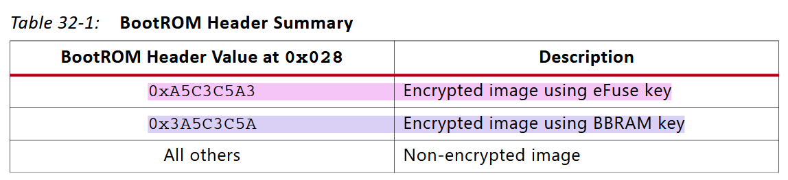

<u>*Secure Boot Image Format*</u> 如下图所示：

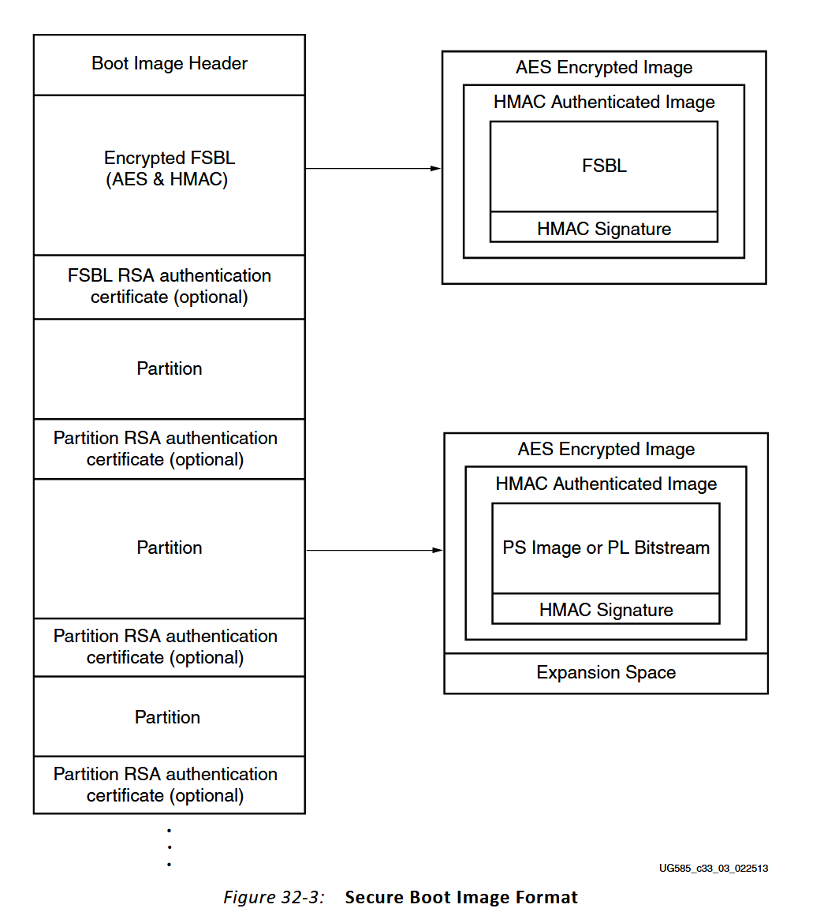

所有 Partition Data 都被加密，并且包含签名，需要使用 AES/HMAC engines 进行解密和验证。但 BootROM 只负责 FSBL 的RSA Authentication，其余 partition data 需要进行rsa authentication的话，需要在软件中实现 rsa algorithm。

<u>*RSA Authentication Certificate：*</u>

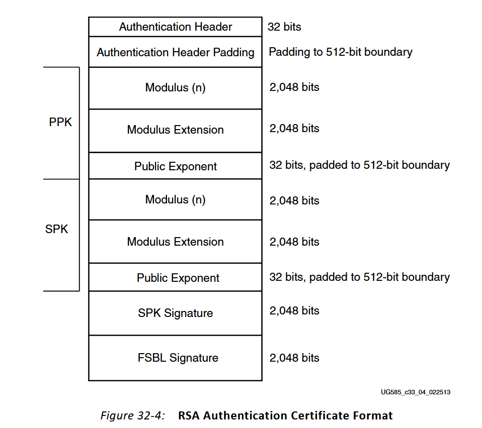

- The FSBL signature includes the FSBL image and the boot image header
- PPK的hash存储在eFuse中，所有Paritition的RSA Authentication Certificate都有PPK和SPK吗？如果是的话，应该是使用相同的PPK&SPK？

## *2.4 eFuse Settings*

<u>*PL eFUSE settings*</u>

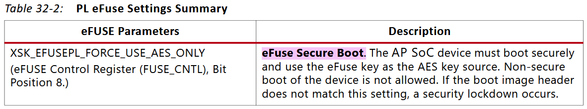

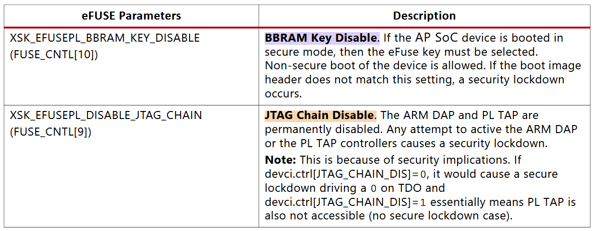

<u>*PS eFUSE Settings*</u>

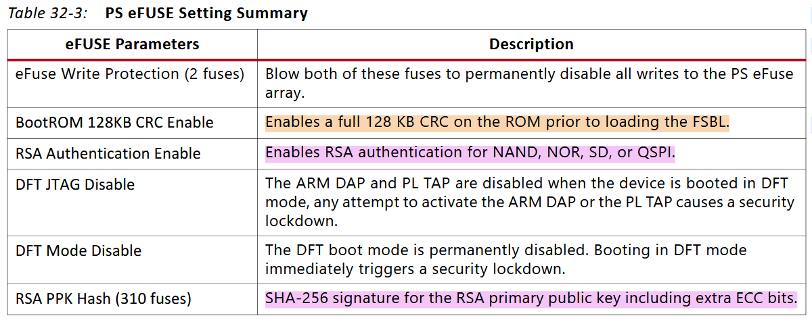

**[PS & PL eFUSE summary](https://support.xilinx.com/s/article/65110?language=en_US)**

eFUSE只能写一次，慎重！！！！

## *2.5 Boot Image Decryption and Authentication*

Xilinx uses the advanced encryption standard (AES) in cipher clock chaining (CBC) mode with 256-bit key.

PS images and PL bitstreams are authenticated with a keyed-hashed message authentication code (HMAC) using the SHA-256 hash algorithm.

AES and HAMC are enabled or disabled in tandem and cannot be separated.

在 SecureBoot 中，只有 FSBL 是强制加密的，FSBL 通过验证开始执行后，便认为 FSBL 是 trusted。其余的PS images可以选择是否加密。如果 boot image 中有需要加载的 bitstream，也应该加密 (from ug585 ”The first configuration bitstream loaded into the PL must also be encrypted.“）

## *2.6 HMAC Signature*

HMAC authentication is performed whenever the AES is used.

When creating an encrypted boot image, the HMAC key must be provided to the bootgen software.The HMAC key and signature are then encrypted with the boot file.

Unlike the AES key, <u>the HMAC key and signature are part of the encrypted image.</u> During the on-chip decryption process, the HMAC signature is extracted from the image and used by the authentication algorithm.

No on-chip storage for the HMAC key is required.

## *2.7 Key Management*

- PPK  and SPK $\rightarrow$ RSA Authentication
  - PPK 的 hash-256 signature存储在eFUSE中
  - PPK 和 SPK 存储在RSA authentication certificate
- AES encryption key $\rightarrow$ boot image encryption
  - 存储在BBRAM或者eFUSE中
- HAMC Key $\rightarrow$ HAMC Authentication
  - 存储在encrypted boot image中，不需要任何 on-chip storage

## *2.8 Secure Boot Features*

FPGA 在上电之后，总是以 secure boot 模式启动，检测到FSBL没有加密之后，进入 non-secure boot 启动流程，并且禁用 AES/HMAC engines 。一旦进入 non-secure boot 模式，不能再切换回secure boot模式，除非重启。

boot image 中的 bistream 必须加密（from ug585 ”The first configuration bitstream loaded into the PL must also be encrypted.“）。之后的 PL partial reconfiguration bitstreams 可以通过PCAP或者ICAP接口加载到PL上，可以选择对paritial reconfiguration bitstreams加密

如果PS images或者partial reconfiguration bitstreams需要加密，必须和加密FSBL使用相同的key。

## *2.9 Security Lockdown*

In a security lockdown the on-chip RAM is cleared along with all the system caches. The PL is reset and the PS enters a lockdown mode that can only be cleared by issuing a power-on reset.

The following conditions cause a security lockdown:

- Non-secure boot specified in the boot image header and secure boot only eFuse is set

- Enabling the JTAG chain or the ARM DAP with the JTAG chain disable eFuse set
- SEU error tracking has been enabled in the PS and the PL reports an SEU error
- A discrepancy in the redundant AES enable logic
- Software sets the FORCE_RST bit of the Device Configuration Control register

## *2.10 JTAG and Debug Considerations*

Whenever the BootROM is running, the PS DAP and the PL TAP controllers are disabled, eliminating any JTAG access to the AP SoC device.

In non-secure boot modes JTAG access is restored once the BootROM has completed execution.

In secure boot modes JTAG access can be restored by the FSBL or subsequent PS images as these applications are considered trusted.

The PS DAP and PL TAP controllers can be permanently disabled using the JTAG CHAIN DISABLE eFuse. The JTAG access to the PL can also be disabled by setting the DISABLE_JTAG configuration option when creating the PL bitstream.

## *2.11 Readback*

Whenever an encrypted bitstream is loaded into the PL, readback of the internal configuration memory cannot be performed by any of the external interfaces, including JTAG. 

The only readback access to the configuration memory after an encrypted bitstream load is via PCAP or ICAP. The PCAP and ICAP interfaces are trusted channels since access to these interfaces are from an authenticated PS image or an authenticated PL bitstream.

## *2.12 Secure Boot Modes of Operation*

The FSBL must be encrypted if any other PS images or PL bitstreams are required to be encrypted.

The BootROM only provides authentication for the FSBL. If any other PS images or PL bitstreams require authentication, the RSA algorithm must be provided as user software.

In the secure boot scenario, with the AES key stored in eFUSE, the SRST causes secure lockdown.

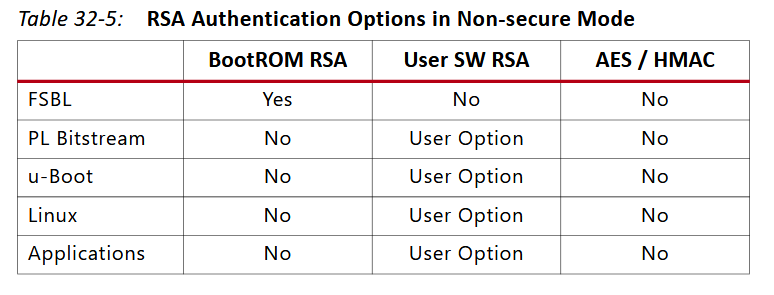

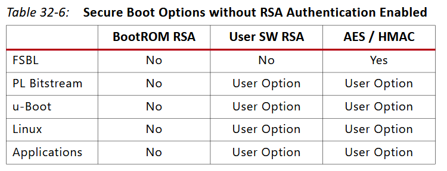

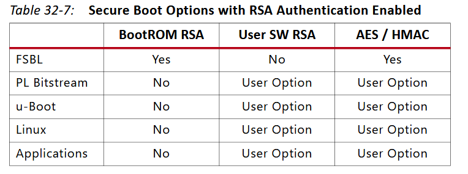

# 3. Sidenotes

**<u>*Programming Considerations about AES/HMAC*</u>**

- Although most of the secure boot process is handled by the BootROM, it is possible to decrypt PS images or PL bitstreams after the initial boot. To decrypt secure images the PL must be powered on. The PL is powered on and ready to accept new encrypted data if the `PCFG_INIT` bit of the Device Configuration Interface (DevC) Status register is set.  
- To send encrypted data to the PL for decryption, the `PCAP_MODE` and `PCAP_PR` bits of the DevC Control register must be set to 1. Because the AES engine decrypts data one byte at a time, the `QUARTER_PCAP_RATE_EN` bit on the DevC Control register must also be set to 1. 
- To disable the AES and HMAC engines, the three `PCFG_AES_EN` bits of the DevC Control register must be set to 0. All three bits must be set with the same register write or a security violation occurs, resulting in a security lockdown of the device. Once the AES and HMAC engines have been disabled, they cannot be enabled again without a power-on-reset.

**<u>*About RoT*</u>**

- 目前来看，hardware RoT 要么在 BBRAM，要么在 eFuse
- 如果要将 RoT 扩展到PUF呢？

**<u>*About BBRAM and eFUSE*</u>**

- **[通过 Software running on PS 向BBRAM中写入数据](https://support.xilinx.com/s/question/0D54U00006nWPIoSAO/is-it-possible-to-program-the-zynq7000-socs-bbram-from-application-software-running-on-the-ps?language=en_US)**
- **[xilskey](https://xilinx-wiki.atlassian.net/wiki/spaces/A/pages/18842311/xilskey+Library)**

**<u>*如何设计我们自己的 Secure Boot Secheme？*</u>**

- 不能和 Xilinx FPGA 的 Secure Boot 机制冲突
- 可以从FSBL着手

