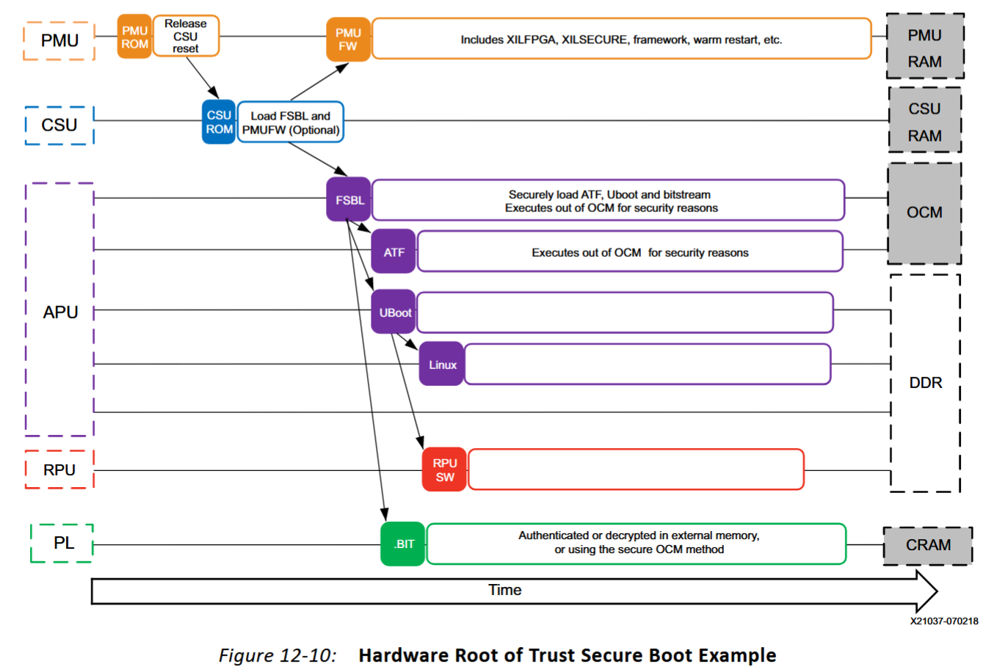

# 1.Repo description
记录如何在ZynqMP上搭建OPTEE开发环境，开发板用的是Zynq MPSoC AXU3EG。如果要用其他的开发板，需要是Zynq MPSoC，在petalinux项目中，重新get-hw-description并重新build即可。

# 2.About docs
建议先将xilinx user guide各个文档的目录看一遍，知道每个文档都在讲什么内容。

下面三个文档是针对zynq7000系列的，记录从零开始在zynq7000上搭建linux：
- docs/zynq7k-bootflow.md: zynq7k的启动流程
- docs/zynq7k-boot from SD.md：记录在zynq7k上搭建linux，并从SD卡启动
- docs/zynq7k-secure boot.md：zynq7k的安全启动机制

docs/xilinx user guide文件夹下面存储了一些user guide，都是2023.2版本

sidenote.md中记录了一些没有归类但是很重要的基础知识。

# 3.How to use
## Step1: petalinux
Petalinux版本为2023.2，搭建optee之前，需要创建Petalinu项目。进行如下配置：
- 开启DNF包管理
- SD卡关闭写保护
- 配置本地 sstate cache
- 设置rootfs格式（SD卡启动）

配置好之后（具体配置过程可以参考`docs/ZynqMP-OPTEE.md`），执行`petalinux-build`
## Step2: makeimage
Petalinux 成功 Build 之后，按顺序执行如下代码：
```bash
cd build && make toolchains
cd .. && make image
```

./build/images文件夹中即为最终的SD卡启动镜像

# 4.About TFA

good features :

- Drivers to enable standard initialization of Arm System IP, e.g. Generic Interrupt Controller(GIC), Cache Coherent Interconnect (CCI), Cache Coherent Network (CCN), Network Interconnect(NIC) and TrustZone Controller(TZC).
- Secure Monitor library code such as world switching, EL2/EL1 context management and interrupt routing.
- Support for Arm CCA based on FEAT_RME which supports authenticated boot and execution of RMM with the necessary routing of RMI commands as specified in RMM Beta 0 Specification.
- <u>A Trusted Board Boot implementation</u>, conforming to all mandatory TBBR requirements. This includes image authentication, Firmware recovery, Firmware encryption and packaging of the various firmware images into a Firmware Image Package (FIP).
- <u>Measured boot support with PoC to showcase its interaction with firmware TPM (fTPM) service implemented on top of OP-TEE.</u>
- <u>Support for Dynamic Root of Trust for Measurement (DRTM).</u>

# 5.Linux setting

关于网卡：启动之后ifconfig是看不到网卡信息的，参考：https://github.com/OP-TEE/optee_os/issues/2767

NFS磁盘挂载：`mount -f nfs -o nolock ip:/<source-path> <destination-path>`

# 6.Zynqmp SoC Boot Process



- The CSU processes the FSBL and PMUFW as two seperate partitions. Consequently, if the FSBL and PMUFW are encrypted, the AES key and IV are reused, which is a violation of the standard. <u>If the FSBL and PMUFW must both be encrypted, the PMUFW must be loaded by the FSBL, and not the CSU</u>.
- <u>At the state of FSBL being booted, control is handed over to the user and the user is responsible for maintaining the chain of trust.</u>
